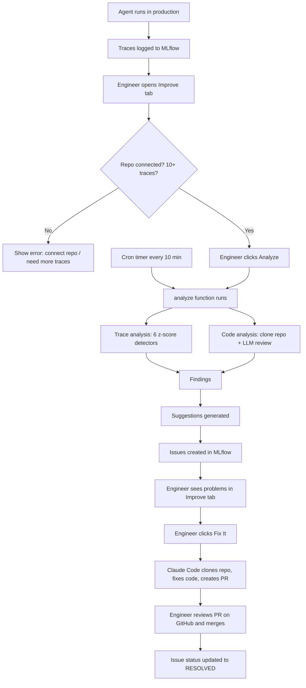

# MLflow Improve — Complete Code Walkthrough

Continuous diagnostics for any MLflow-traced agent. Analyzes both traces and
codebase to detect problems, then lets engineers create fix PRs via Claude Code.

---

## How It Works (Overview)



---

## Step-by-Step Data Flow

### Step 1: Agent logs traces

Any agent using MLflow tracing (`@mlflow.trace`, `mlflow.openai.autolog()`,
`mlflow.langchain.autolog()`, etc.) automatically records spans to the MLflow
database. Each span has standard fields: `mlflow.spanType`, `status.code`,
`mlflow.spanInputs`, timestamps. These fields are framework-agnostic — they
work the same for OpenAI Agent SDK, LangChain, CrewAI, or raw Python.

### Step 2: Engineer connects a GitHub repo

In the Improve tab, the engineer types `owner/repo-name` and clicks Connect.
This saves the repo URL as the `mlflow.improve.github_repo` experiment tag.
**GitHub only** — GitLab and Bitbucket are not supported.

### Step 3: Analysis runs

Either the engineer clicks Analyze (manual) or the cron timer triggers it
(every 10 minutes). Both call the same `analyze()` function.

**Requirements:** A connected GitHub repo AND at least 10 traces. If either is
missing, `analyze()` returns an error message explaining what's needed.

`analyze()` always runs both:
1. **Trace analysis** — fetches the 20 most recent traces, parses each one,
   runs 6 statistical detectors
2. **Code analysis** — clones the GitHub repo, selects relevant files by
   priority scoring, sends them to an LLM for review

### Step 4: Trace analysis details

`_parse_trace()` reads each trace's spans and extracts:
- Tool names (spans with type "TOOL")
- Error count and error messages (spans with STATUS_CODE_ERROR)
- User query (from root span inputs)
- Execution time, trace size, assessment scores

Then 6 detectors run on the parsed data using **z-score statistics** — they
compare recent behavior to a baseline of older data:

| Detector | What it detects | Method |
|----------|----------------|--------|
| `_detect_context_bloat` | Traces too large | Z-score of trace size vs baseline |
| `_detect_context_growth` | Traces getting larger | Z-score of recent size trend |
| `_detect_tool_redundancy` | Same tool called multiple times | Z-score of duplicate rate |
| `_detect_score_degradation` | Quality scores dropping | Z-score of pass rate |
| `_detect_slowdown` | Agent getting slower | Z-score of execution time |
| `_detect_error_spike` | Error rate increasing | Z-score of error rate |
| `_detect_incomplete_pipeline` | Pipeline steps skipped | Tools missing from >70% threshold |

**How z-scores work:** Split data into baseline (older values) and recent
window (last 3). Compute how many standard deviations the recent mean differs
from the baseline mean. z >= 2.0 = high severity, z >= 1.5 = medium,
z >= 1.0 = low.

### Step 5: Code analysis details

1. `clone_or_fetch_repo()` — clones the GitHub repo to a temp directory
   (cached per session so subsequent calls just `git fetch`)
2. `select_relevant_files()` — walks the file tree, scores each file:
   - +10 per AI keyword in path (agent, prompt, tool, pipeline, mcp, etc.)
   - +15 for files matching tool names seen in traces
   - +3 for .py files, -5 for test files
   - Selects files until 150,000 character budget is filled
3. `analyze_code()` — sends file contents + trace findings to an LLM with a
   system prompt for "expert code reviewer specializing in AI agent systems."
   Returns structured findings with category, severity, file, problem,
   root cause, and suggested fix.

### Step 6: Suggestions generated

Each Finding (from traces or code) is dispatched to a pattern-specific handler
in `suggestions.py` that creates a Suggestion with: title, description,
recommended action, severity, confidence score, and category (heal or improve).

- **heal** category: errors and failures that need fixing
- **improve** category: optimizations and enhancements

### Step 7: Results displayed in the Improve tab

The UI shows two tabs:
- **Fix** — heal-category suggestions + error alerts. Each has a "Fix It" button.
- **Improve / Fine-Tune** — improve-category suggestions

Plus a **Resolved** tab showing Issues that have been fixed (with PR links).

### Step 8: Engineer clicks Fix It

1. UI sends the suggestion details to `/improve/fix`
2. Handler checks for `claude` CLI and `gh` CLI — returns clear error if missing
3. `ClaudeCodeAgent.create_fix()` runs:
   - Clones the repo, copies to temp directory
   - Creates branch `improve/fix-{issue_id}`
   - Builds a prompt with the issue details
   - Runs Claude Code (SDK or CLI)
   - Claude analyzes the code, makes changes, commits
   - Pushes to GitHub, creates a PR via `gh pr create`
4. The matching Issue entity is updated to status=RESOLVED with the PR URL

### Step 9: Cron timer

The scheduler is just a timer that calls `analyze()` every 10 minutes for each
experiment with a connected repo. It creates MLflow Issue entities for any
findings so they're visible in the Improve tab even if the engineer hasn't
clicked Analyze recently.

---

## File Map

```
~/mlflow/mlflow/genai/improve/
├── __init__.py              Main analyze() function — orchestrates everything
├── trace_analyzer.py        Parses traces, runs 6 z-score detectors
├── code_analyzer.py         Clones repo, selects files, runs LLM code review
├── suggestions.py           Converts Findings into actionable Suggestions
├── summary.py               Computes health stats and error alerts
├── scheduler.py             Cron timer — calls analyze() every 10 minutes
├── background_work.py       Async job wrappers for analysis and fix tasks
├── fix_agent_registry.py    Abstract CodeAgent interface + plugin registry
├── fix_agents/
│   ├── __init__.py          Registers ClaudeCodeAgent on import
│   └── claude_code_agent.py Claude Code implementation — creates PRs
├── utils.py                 normalize_repo_url() — GitHub URL parsing
└── WALKTHROUGH.md           This file

~/mlflow/mlflow/server/
├── handlers.py              HTTP endpoints (part of MLflow's server):
│                              /improve/invoke — runs analyze()
│                              /improve/fix — triggers fix agent
│                              /improve/feedback — follow-up on PR
│                              /improve/pr-status — GitHub PR statuses
└── jobs/utils.py            Registers the cron timer as a Huey periodic task
```

---

## Technical Concepts

### Z-Score Statistical Baselines

Used by all 6 trace detectors. The idea: compare recent behavior to historical
behavior and flag significant deviations.

```
baseline = older data points (everything except the last 3)
recent = last 3 data points
z-score = (recent_mean - baseline_mean) / baseline_stdev
```

A z-score of 2.0 means the recent data is 2 standard deviations above the
baseline — a statistically significant change. If fewer than 5 total data
points exist, the detectors use hardcoded fallback thresholds instead.

### MLflow Issue Entities

Issues are MLflow's built-in way to track problems. The improve system uses
them to record findings and fix status:

- Created by the scheduler when findings are detected (status: PENDING)
- Updated to RESOLVED when a Fix It PR is created (PR URL in description)
- Searched via `search_issues(experiment_id, filter_string="status = 'resolved'")`
- Stored in MLflow's database (not experiment tags)

### Huey Job Queue

MLflow uses Huey for async work. Two types:
- **Periodic tasks** — the cron timer runs every 10 minutes
- **One-shot jobs** — the fix task runs when Fix It is clicked

### Span Attribute Parsing

MLflow stores span attributes as JSON in the database. When they come back
from `search_traces()`, they may be a Python dict or a JSON string. The
`_extract_span_info()` function handles both: tries `json.loads()` first,
falls back to `ast.literal_eval()` for Python-formatted strings.

---

## Experiment Tags Used

| Tag | Purpose |
|-----|---------|
| `mlflow.improve.github_repo` | Connected GitHub repo (`owner/repo`) |
| `mlflow.improve.github_repo_source` | `"auto"` (from traces) or `"manual"` (UI) |
| `mlflow.improve.github_branch` | Branch to analyze/fix (default `main`) |
| `mlflow.improve.code_agent` | Which fix agent to use (default `claude-code`) |
| `mlflow.improve.last_monitor_time` | ISO timestamp — rate-limits cron per experiment |
| `mlflow.improve.last_snapshot` | JSON summary of the last analysis run |
| `mlflow.improve.last_patterns` | JSON array of finding patterns found |
| `mlflow.improve.monitor_interval_minutes` | Per-experiment cron interval (default 10) |

Fix tracking uses MLflow Issue entities (not tags).

---

## Dependencies

| Tool | Required for | Install |
|------|-------------|---------|
| `claude` CLI | Creating fix PRs (Fix It button) | `npm install -g @anthropic-ai/claude-code` |
| `gh` CLI | Creating GitHub PRs | https://cli.github.com/ |
| `git` | Cloning repos for code analysis | Pre-installed on most systems |

These are only needed for the Fix It flow. Analysis works without them.

---

## Testing

```bash
cd ~/mlflow && uv run python -m pytest tests/genai/improve/ -v
```

Manual verification:
```bash
# Test the analysis endpoint
curl -s -X POST "http://localhost:5001/ajax-api/3.0/mlflow/improve/invoke" \
  -H "Content-Type: application/json" \
  -d '{"experiment_id": "1"}' | python3 -m json.tool

# Verify cron interval
grep "crontab" ~/mlflow/mlflow/server/jobs/utils.py | grep improve

# Verify no auto-fix code
grep -n "auto_fix\|_maybe_auto_fix" ~/mlflow/mlflow/genai/improve/scheduler.py
```
